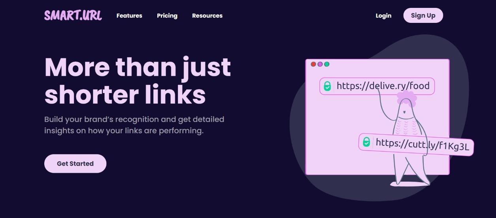

<h1>SMART.URL</h1>

Website: <a href="https://sikta2002.github.io/SMART.URL/">Click here</a>

<h2>Overview</h2>

- SMART.URL is a URL shortening API landing page, integrated with the <a href="https://shrtco.de/">shrtcode</a> URL shortening API.
- Uses browser storage which helps users see a list of their shortened links, even after refreshing the browser.

<h2>Features</h2>

Users can : 

- Shorten any valid URL
- See a list of their shortened links, even after refreshing the browser
- Copy the shortened link to their clipboard in a single click
- Receive an error message when the form is submitted if:
  - The input field is empty
  - The input is invalid 

<h2>Built With</h2>

- HTML
- CSS
- JavaScript

<h2>Reference</h2>

- This project is inspired by one of the <a href="https://www.frontendmentor.io/challenges">Frontend Mentor Challenges</a>. I started off by completing that challenge first (<a href="https://www.frontendmentor.io/solutions/url-shortening-api-landing-page-using-html-css-javascript-W8KO3Lrg8E">Check it out</a>).
- As I progressed with the challenge I kept on marking all the features I wanted to add or change for my take on the project.
- I started by changing the color scheme of the website. After playing around with multiple colors I stuck to blues-pinks-grays.
- I also wanted to try some fun hover effects, so I did some research over multiple platforms and the 'underline on hover' effect attracted me the most for this website.
- As for the images and patterns, I took the help of <a href="https://www.figma.com/">Figma</a> and created images with the perfect color scheme for my website.

<h2>Things I Learnt</h2>

- I got to learn about the local storage feature (browser).
- The importance of different fonts and their impacts.
- Color schemes can change the feel of any website.
- Subtle changes can add much value to any website.
